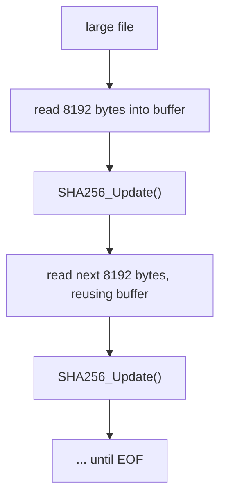
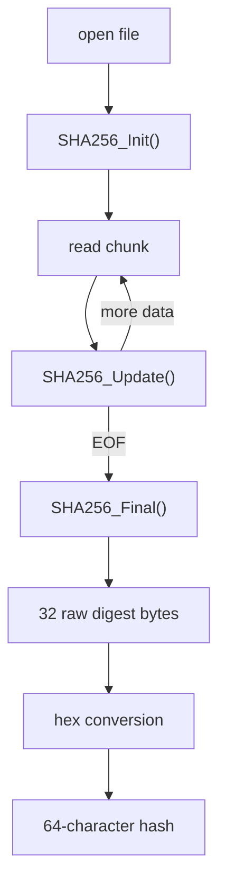

# FIM v1: Syntax & Semantics

> [!NOTE]
> Companion to the *C++ Notes* (pointers, nibbles, hex conversion). This file covers filesystem traversal, chunked file reading, the OpenSSL SHA-256 API, and the bugs hit along the way.

## Contents

1. [Filesystem Iteration](#1-filesystem-iteration)
2. [File Handling](#2-file-handling)
3. [Chunked Reading](#3-chunked-reading)
4. [The Read Loop](#4-the-read-loop)
5. [OpenSSL SHA-256 API](#5-openssl-sha-256-api)
6. [Hashing One File](#6-hashing-one-file)
7. [Two Levels of Looping](#7-two-levels-of-looping)
8. [Errors & Lessons](#8-errors--lessons)
9. [Core Mental Model](#9-core-mental-model)

---

## 1. Filesystem Iteration

### `recursive_directory_iterator`

Walks a directory **and everything beneath it**.

```cpp
std::filesystem::recursive_directory_iterator(target)
```

```text
target/
├── a.txt
├── b.txt
└── subdir/
    └── c.txt
```

Visit order: `a.txt` → `b.txt` → `subdir/` → `c.txt`. Directories are visited as entries too, so you must filter them out.

### Range-based traversal

```cpp
for (const auto& entry :
     std::filesystem::recursive_directory_iterator(target))
{
    // use entry here
}
```

`entry` is the **current filesystem entry**, not the iterator. The iterator is the machinery that advances through the tree; `entry` describes whatever it is currently pointing at.

| Call | Answers |
|---|---|
| `entry.path()` | Where is it? |
| `entry.is_regular_file()` | Is it a file we should hash? |
| `entry.is_directory()` | Is it a folder to skip? |

### Iterator vs pointer

| | Represents | Solves |
|---|---|---|
| **Pointer** | An address in memory | Accessing a specific location |
| **Iterator** | A position within a traversal | Walking through a collection or range |

Both give access to things, but they solve different problems.

---

## 2. File Handling

### `std::ifstream`

```cpp
std::ifstream file(entry.path(), std::ios::binary);
```

An input stream bound to the discovered file. The two pieces divide the work cleanly:

| Component | Job |
|---|---|
| `recursive_directory_iterator` | Finds **which** file |
| `ifstream` | Reads **the contents** of that file |


### Binary mode

`std::ios::binary` opens the file as **raw bytes**.

> [!IMPORTANT]
> A FIM must hash the *exact bytes on disk*. Text mode can apply platform-specific translation (such as line-ending handling), which risks hashing something different from what is actually stored.

---

## 3. Chunked Reading

Instead of loading the whole file, use a fixed-size buffer and reuse it:

```cpp
constexpr std::size_t BUFFER_SIZE = 8192;
std::vector<char> buffer(BUFFER_SIZE);
```



Memory use stays constant regardless of file size. A 10 MB file does **not** need a 10 MB buffer.

### Three buffer-related calls

**`buffer.data()`** returns a pointer to the vector's underlying contiguous memory. This is the destination `ifstream::read()` writes into.

```text
vector
┌──────────────────────────┐
│       buffer memory      │
└──────────────────────────┘
↑
buffer.data()
```

**`buffer.size()`** returns how many elements the vector holds. For `std::vector<char> buffer(8192)` that is `8192`, the **maximum** bytes requested per read:

```cpp
file.read(buffer.data(), buffer.size());
```

**`file.gcount()`** returns how many bytes the **most recent** input operation *actually* extracted.

### Why `gcount()` matters

The last chunk is usually smaller than the buffer:

| Read | Bytes obtained |
|---|---|
| 1 | 8192 |
| 2 | 8192 |
| 3 | **3616** *(file was 20,000 bytes)* |

```cpp
SHA256_Update(&ctx, buffer.data(), file.gcount());   // correct
SHA256_Update(&ctx, buffer.data(), buffer.size());   // wrong
```

> [!WARNING]
> Passing `buffer.size()` on the final chunk would feed **stale bytes from the previous read** into the hash, producing the wrong digest.

---

## 4. The Read Loop

```cpp
while (file.read(buffer.data(), buffer.size()) ||
       file.gcount() > 0)
{
    SHA256_Update(&ctx, buffer.data(), file.gcount());
}
```

The two conditions cover two situations:

| Case | `read()` result | `gcount()` | Handled by |
|---|---|---|---|
| **Full chunk** | succeeds | `8192` | `file.read(...)` |
| **Final partial chunk** | fails (hit EOF early) | `> 0` | `file.gcount() > 0` |
| **Nothing left** | fails | `0` | loop exits |

On the final partial read, `read()` reports failure because it could not fill the buffer, yet it did still extract some bytes. Without `|| file.gcount() > 0`, those last bytes would be silently dropped.

---

## 5. OpenSSL SHA-256 API

A three-stage pattern:


| Function | Purpose |
|---|---|
| `SHA256_CTX ctx;` | Holds the internal hashing state while input is processed |
| `SHA256_Init(&ctx);` | Creates/resets that state. Once **per file** |
| `SHA256_Update(&ctx, ptr, len);` | Feeds another chunk into the hash. Called repeatedly |
| `SHA256_Final(md, &ctx);` | Finishes the calculation and writes the digest into `md` |

```cpp
unsigned char md[SHA256_DIGEST_LENGTH];   // 32 raw bytes
SHA256_Final(md, &ctx);
```

`Update` being repeatable on one context is exactly what allows streaming: the file never needs to exist in memory all at once. The 32-byte `md` is then converted into the 64-character hex string (see the C++ Notes).

---

## 6. Hashing One File



> [!IMPORTANT]
> The context must be initialized **inside the per-file loop**. Otherwise multiple files collapse into one continuous input stream.

---

## 7. Two Levels of Looping

```text
Outer loop → filesystem entries (which file?)
   └── Inner loop → chunks of the current file (which part?)
```

```text
for each filesystem entry
    ├── open this file
    ├── initialize SHA-256
    ├── while file has data
    │      └── read chunk + update hash
    ├── finalize hash
    └── report result
```

| Loop | Question it answers |
|---|---|
| Outer | *Which file am I processing?* |
| Inner | *Which portion of this file am I processing?* |

---

## 8. Errors & Lessons

<details>
<summary><b>1. <code>std::bad_alloc</code></b></summary>

<br>

**Triggered by** sizing a buffer from the whole file:

```cpp
file.seekg(0, std::ios::end);
std::streamsize size = file.tellg();
std::vector<char> buffer(size);
```

`bad_alloc` means an allocation request
