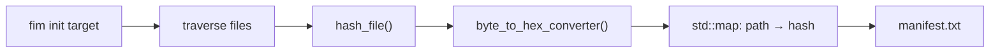

# FIM v0.2: Refactor, Manifest and Baseline Notes

> [!NOTE]
> **Implemented:** header/source split, manifest generation, baseline storage.
> **Not implemented:** comparison (`check`).



---

## 1. Code Organisation

### Header / implementation split

A header *declares* an interface; a source file *defines* it. Header = menu, `.cpp` = kitchen.

```cpp
// fim.hpp
std::array<unsigned char, SHA256_DIGEST_LENGTH>
hash_file(const std::filesystem::path& path);
```

```cpp
// fim.cpp
std::array<unsigned char, SHA256_DIGEST_LENGTH>
hash_file(const std::filesystem::path& path)
{
    // implementation
}
```

> [!IMPORTANT]
> - Use `#pragma once` (or include guards) so the header isn't processed twice in one file.
> - The header must include what its own declarations need (`<array>`, `<filesystem>`, `<openssl/sha.h>`).
> - Put function *definitions* in the `.cpp`, not the header.

### Translation units and linking

A **translation unit** is a `.cpp` file after preprocessing, with every `#include` pasted in. Each is compiled separately, then the linker joins them.

```text
main.cpp → main.o ─┐
                   ├─ linker → fim
fim.cpp  → fim.o  ─┘
```

The declaration in `fim.hpp` lets `main.cpp` *compile* a call to `hash_file()`. The definition is found at *link* time.

| Error | Stage |
|---|---|
| `'hash_file' was not declared` | Compiler (missing include) |
| `undefined reference to hash_file` | Linker (no definition, or `fim.cpp` missing from CMake) |

### Include search paths

The compiler searches a list of directories when resolving `#include`.

```cmake
target_include_directories(fim PRIVATE include)
```

This allows `#include "fim/fim.hpp"` instead of `"../include/fim/fim.hpp"`.

### API and function contract

An **API** is the interface one piece of software exposes to another. OpenSSL's `SHA256_*` calls are APIs you use; `hash_file()` is one you expose.

| Part | `hash_file()` |
|---|---|
| Input | File path |
| Output | 32-byte SHA-256 digest (not hex text) |

> [!WARNING]
> A bare `std::array` return can't signal failure (such as an unopenable file). Decide how failure is reported.

---

## 2. Arrays, Pointers and References

### `std::array`

A fixed-size container of exactly `N` elements. Think of a box with 32 numbered slots.

```cpp
std::array<unsigned char, SHA256_DIGEST_LENGTH> md{};
return md;   // safe to return by value
```

### `.data()`

Returns a pointer to the first element of a contiguous container.

```cpp
SHA256_Final(md.data(), &ctx);   // OpenSSL needs unsigned char*
```

### Array-to-pointer decay

A C array name converts to a pointer to its first element in most expressions.

```cpp
unsigned char md[SHA256_DIGEST_LENGTH];
SHA256_Final(md, &ctx);          // md → &md[0]
```

> [!WARNING]
> Decay *loses information*. Arrays and pointers are **not** the same thing:
>
> | Expression | Result |
> |---|---|
> | `sizeof(md)` (array) | `32` |
> | `sizeof(p)` for `unsigned char* p = md;` | pointer size (8 on 64-bit) |
> | `&md` | pointer to the **whole array** |
> | `&md[0]` | pointer to the **first element** |

### `const` reference

`const T&` refers to an existing object without copying it, and forbids modification through that reference.

```cpp
std::string byte_to_hex_converter(
    const std::array<unsigned char, SHA256_DIGEST_LENGTH>& bytes);
```

| Piece | Effect |
|---|---|
| `&` | No copy |
| `const` | Can't modify `bytes` through this name |

### Array reference

```cpp
const unsigned char (&bytes)[32]
```

A reference to an array of exactly 32 `const unsigned char`, with no decay. The parentheses are required. You considered this for the digest, then chose `std::array`, which gives the same size safety with simpler syntax.

---

## 3. `std::map` and Iterators

### `std::map`

Key-value pairs with **unique keys, sorted by key**. Think of a dictionary.

```cpp
std::map<std::filesystem::path, std::string> hex_path_map;   // path → SHA-256 hex
hex_path_map[entry.path()] = hex;
```

Each element is a `std::pair<const Key, Value>`:

| Member | Holds |
|---|---|
| `first` | Key (path) |
| `second` | Value (hash) |

### Iterators

An iterator is a position in a container. It's like a bookmark in a dictionary.

```cpp
auto it = current_map.find(path);
it->first;    // path
it->second;   // hash
```

Iterators generalise pointers. They exist because containers like `map` aren't laid out contiguously.

### `find()` vs `operator[]`

| | `find(key)` | `operator[](key)` |
|---|---|---|
| Key absent | returns `end()` | **inserts** a default value |
| Modifies the map | No | Possibly |

Use `find()` when a missing key must **not** create an entry.

> [!CAUTION]
> Dereferencing `end()` is undefined behaviour. Compare the result of `find()` against `end()` first.

### Paths as keys

`./protected/a.txt`, `protected/a.txt` and the absolute path are **different keys** for the same file. Normalising paths to one consistent form matters for any later lookup.

---

## 4. CLI and File I/O

### Command-line arguments

```cpp
int main(int argc, char* argv[])
```

For `fim init ./protected`:

```text
argc    = 3
argv[0] = program name (as invoked)
argv[1] = "init"
argv[2] = "./protected"
```

> [!WARNING]
> - `argv[0]` is the name or path used to launch the program (e.g. `./build/fim`), so don't compare it to `"fim"`.
> - Check `argc` **before** reading `argv[n]`.

### Streams

| Class | Role |
|---|---|
| `std::ifstream` | Reads a file |
| `std::ofstream` | Writes a file |

```cpp
std::ifstream file(path, std::ios::binary);   // hashing: exact bytes
std::ofstream manifest("manifest.txt");       // text output
```

- `ofstream` **truncates** an existing file when it opens it.
- A relative path resolves against the *current working directory*.
- Check that the stream opened: `if (!manifest) { ... }`.

---

## 5. Manifest and Baseline

### Serialization

Converting in-memory data into a stored form that can be rebuilt later. It's like copying temporary notes into a notebook.

```text
std::map  →  manifest.txt
```

The map disappears when the program exits; the manifest remains.

### Line format

```text
<64-char hash>␠␠<path>
```

```text
7a1f3c...e9  a.txt
93bc01...4d  sub/c.txt
```

| Choice | Reason |
|---|---|
| Hash first | Fixed width (64 chars), never contains spaces |
| Path last | Spaces in file names can't break parsing |

> [!WARNING]
> A `path hash` layout split on whitespace breaks on `my notes.txt`.

### Baseline

A **baseline** is a trusted reference state to compare against later. It's like a photograph of a room before you leave.

```text
init → filesystem → hashes → manifest (baseline)
```

> [!IMPORTANT]
> **Self-hashing trap.** If `manifest.txt` is written *inside* the monitored directory, the next traversal hashes it too, and its hash changes every time it is rewritten. Keep the manifest outside the target, or skip it.

> [!WARNING]
> A baseline is only as trustworthy as how and when it was made. One taken from an already-compromised system records the compromise as normal, and one stored where an attacker can write to it can be edited to match.

---

## 6. Design Principles

### Separation of responsibility

| Function | Job |
|---|---|
| `hash_file()` | File bytes → digest |
| `byte_to_hex_converter()` | Digest → printable text |
| `main()` | Orchestration / CLI |

### Explicit data flow, no globals

```cpp
auto md  = hash_file(path);
auto hex = byte_to_hex_converter(md);
```

Data moves through parameters and return values. There is no global `md`.

### Streaming: what is bounded

| Part | Memory grows with |
|---|---|
| Hashing (8192-byte chunks) | Nothing |
| The path → hash map | **Number of files** |

> [!IMPORTANT]
> Streaming makes memory independent of *file size*, not *file count*.

### `init` vs `check`

| Command | Purpose |
|---|---|
| `fim init <dir>` | Create the baseline |
| `fim check <dir>` | Compare against the baseline *(not implemented)* |

> [!WARNING]
> `init` writing over an existing manifest destroys the trusted baseline, so decide what it should do when one already exists.
